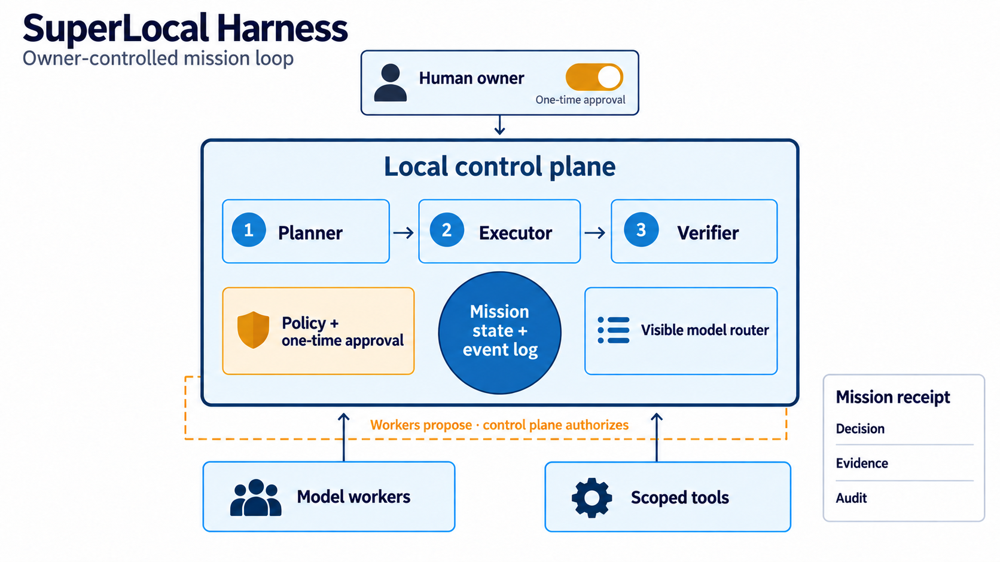

# SuperLocal Harness MVP

[](https://github.com/Cornelius-Chen/SuperLocal-Harness/actions/workflows/verify.yml)

SuperLocal Harness is a local-first mission control layer for model switching, long-running coding and research tasks, explicit budgets, human approval for mutations, and supervised verification. It includes a Guanlan blind-research profile, but has no trading authority.

It is intentionally **not** another generic chat wrapper. Models are replaceable workers. Mission state, evidence, approvals, budgets and audit history remain locally authoritative.

## See one mission finish

Run the included offline example with Python 3.12 or newer. It creates a temporary project and database, selects the built-in demo model, and runs a read-only mission through planning, execution and verification:

```bash
python -m scripts.demo
```

```text
Mission: completed (offline demo model)
Roles: planner -> executor -> verifier
Approval requests: 0
Event integrity: ok
Stored events: 15
```

This proves the local workflow and persisted audit path are runnable without a provider key. The demo model returns scripted responses; its PASS verdict is **not** independent model verification or evidence of real task quality. The tests also cover a separate mutation proposal that stays pending until a one-time human approval.

## Architecture: authority stays local



The model worker proposes an action. The local policy engine checks the project's scope and either allows read-only work, requests one-time approval for a write or command, or denies the action. SQLite mission state and a hash-chained event stream retain the decision and evidence across restarts. Hashes reveal local tampering; they are not externally anchored signatures. See [the architecture](docs/ARCHITECTURE.md) and [security boundaries](docs/SECURITY.md).

| Design question | Decision in this MVP |
| --- | --- |
| Who owns the mission? | Local SQLite state and events, not a model transcript or browser tab. |
| Who chooses the model? | Explicit selection or a visible static router; local-only removes cloud candidates before routing. |
| Who authorizes side effects? | A local policy engine and a one-time human approval for file mutation or shell commands. |
| Who checks the result? | A separate verifier stage, with reduced independence recorded when it uses the same model. |


## What v0.1 already does

- One visible model picker for DeepSeek, Ollama/local Qwen and any OpenAI-compatible gateway.
- An `Auto` route whose decision and fallbacks are recorded instead of hidden.
- Persistent SQLite missions that resume after restart.
- `plan → execute → verify` and solo workflows.
- Separate planner, executor and verifier roles; a different verifier model is preferred.
- Read/search/git tools plus approval-gated file writes, patches and shell commands.
- Hard blocks for destructive commands and broker/trading side effects.
- Hash-chained append-only mission events with an integrity indicator.
- Durable mission state outside the chat transcript to control context growth.
- Mission and daily USD budgets when current prices and provider usage are available; missing usage is shown as unknown.
- Profiles for supervised coding, evidence-first research, Guanlan blind research, AI Studio exploration, coursework learning and read-only inspection.
- A dependency-free Python 3.12 server and browser UI, verified by CI on Windows. macOS and Linux are not yet checked by CI.
- An offline demo model for installation tests—no key and no model download required.

## Five-minute Windows start

1. Extract this folder to a stable location, for example `D:\Projects\SuperLocal-Harness`.
2. Open PowerShell in that folder.
3. Run:

   ```powershell
   Set-ExecutionPolicy -Scope Process Bypass
   .\scripts\setup.ps1
   notepad .env
   ```

4. In `.env`, set at least the correct project roots. Add `DEEPSEEK_API_KEY` if you want the cloud models.
5. Start locally:

   ```powershell
   .\scripts\run-local.ps1
   ```

6. Open `http://127.0.0.1:8765`.
7. Select `Demo model · offline` and run one read-only mission first.

No package installation is needed beyond Python 3.12+. `uv run python -m superlocal_harness` also works if you prefer uv.

## DeepSeek

Set these in `.env`:

```dotenv
DEEPSEEK_API_KEY=your_key_here
DEEPSEEK_FLASH_MODEL=deepseek-chat
DEEPSEEK_REASONER_MODEL=deepseek-reasoner
```

The UI labels map to actual provider/model pairs. Selecting DeepSeek changes both, so this does not have the provider/model mismatch that motivated the project.

Prices are deliberately not frozen into the repository because they change. Enter current input and output prices per million tokens in `.env` before treating USD budgets as exact. If a provider omits usage or a cloud model lacks either price, the usage summary returns `null` for the affected total and the mission view shows **Unknown**, rather than presenting a measured zero. A USD budget cannot be verified from an unknown total. Older usage rows without measurement flags are also treated as unknown. The offline demo uses estimated token counts and makes no paid call.

## Local models with Ollama

Install Ollama, pull models that fit the MSI's actual VRAM/RAM, then put their exact tags in `.env`:

```dotenv
OLLAMA_BASE_URL=http://127.0.0.1:11434/v1
OLLAMA_CODER_MODEL=your-coder-model-tag
OLLAMA_FAST_MODEL=your-small-model-tag
```

Run `scripts\doctor.ps1` to test every configured endpoint. A local model is not treated as healthy merely because its name exists in configuration.

Ollama can now also add compatible local/cloud models directly to ChatGPT Desktop's Codex picker. Use that for ordinary Codex sessions; use this Harness when you need persistent missions, Guanlan blind boundaries, budgets, approvals and verification.

## Access from the Mac through Tailscale

The Harness should run on the MSI beside the data. Do not copy Guanlan data to the Mac.

1. Set a long random `HARNESS_ACCESS_TOKEN` in `.env`.
2. Start with `scripts\run-tailnet.ps1`.
3. From the Mac, open `http://<MSI_TAILSCALE_IP>:8765`.
4. Enter the access token once when prompted.

The server refuses non-loopback startup without an access token. Keep Windows Firewall limited to the Tailnet; do not port-forward this service to the public internet.

## Guanlan blind profile

Choose `Guanlan · blind research`. The policy layer rejects reads/writes containing path segments such as:

```text
teacher / sealed / future / answer_key / revealed / post_window / labels_future
```

That is a guardrail, not a substitute for correct run packaging. Each fresh I1/I2/I3 run should receive a clean visible directory and a separate sealed directory. See [docs/GUANLAN_PROFILE.md](docs/GUANLAN_PROFILE.md).

## Authority model

| Action | Default |
| --- | --- |
| list/read/search/git status/diff | automatic within project and profile scope |
| durable mission-state update | automatic and audited |
| write file / apply patch | one-time human approval |
| shell command | one-time human approval |
| destructive shell pattern | blocked |
| broker/trading side effect | blocked |
| sealed Guanlan path | blocked |

The model proposes tool calls; the policy engine authorizes them. Approving one call does not permanently widen authority.

## Important v0.1 boundaries

The following are intentionally not pretended complete:

- MCP client and ACP worker adapters are interface targets, not yet implemented.
- Goose, Cline, OpenCode and OpenHands are not bundled or silently installed.
- Parallel code writers do not yet receive isolated git worktrees.
- Context compaction is deterministic truncation plus durable state, not learned summarization.
- The UI has polling rather than token streaming.
- USD limits cannot be verified when provider usage or current input/output prices are missing.
- No browser/computer-use tool and no autonomous trading or posting.

These omissions keep v0.1 small enough to inspect and test. The next admission gate is evidence that the model gateway, router, token ledger and mission recovery reduce cost or human time without lowering verified quality.

## Commands

```powershell
# Configuration without starting the server
python -m superlocal_harness config

# Endpoint and database diagnostics
python -m superlocal_harness doctor

# Run tests
python -m unittest discover -s tests -v

# Start
python -m superlocal_harness serve
```

## Design documents

- [Architecture](docs/ARCHITECTURE.md)
- [Open-source component decisions](docs/OPEN_SOURCE_DECISIONS.md)
- [Guanlan blind profile](docs/GUANLAN_PROFILE.md)
- [Security and threat boundaries](docs/SECURITY.md)
- [Next implementation gates](docs/ROADMAP.md)
